# Installing Virtualization Software on the Host Computer

Unless your host computer is already natively running Ubuntu 16.04LTS
you need to do some work to get Ubuntu 16.04 LTS running on your host
computer.

## Overview

The steps involved are:

1. You need to figure out if you need to install virtualization software.
   (Most of you will need virtualization software.)

2. Download and install the virtualization software.  Ubiquity Robotics only supports
   the VirtualBox virtualization software from Oracle.

3. Create a virtual machine using VirtualBox.

4. Load Ubuntu 16.04 into the virtual machine.

5. Install the virtual box guest extensions into the virtual machine.

With no further adeau, you can get started now.

## Is Virtualization Software Needed

For this document, we partition native operating systems into ones
that are base Linux operating systems and non-Linux based operating systems
(e.g. Windows, Mac OS, Solaris, etc.).

You can skip reading the rest of this section,
if your host computer is running non-Linux native operating system.
All non-Linux native operating systems require the installation of
virtualization software.

If you are running Linux natively on your host computer please run the
following command in a terminal window:

        lsb_release -i -r

and it will output:

        Distributor ID: DDDDDD
	Release:        RRRRRR

where `DDDDDD` is the distributor name (e.g. Ubuntu, Redhat, etc.)
and `RRRRRR` is the release.

* If your distributor id is `Ubuntu` and the release number is 16.04, you are
  done and no virtualization software needs to be installed.

* If your distributor id is not `Ubuntu` you *must*
  install the virtualization software.

* If your distributor id is `Ubuntu`, but the release number is less than 16.04,
  you can upgrade your Ubuntu release to 16.04.  LTS releases always occur
  on in April of even years (i.e. 1x.04, where x is even.)  To upgrade,
  always go to the closest new LTS release and then upgrade LTS releases
  until you get to 16.04.  For example, to upgrade Ubuntu 11.10, first upgrade
  to 12.04, then 14.04 and finally to 16.04.  Use your web favorite search
  engine an search for "Upgrade Ubuntu xx.xx to yy.yy" to get instructions
  on how to do this.

* If your distributor id is `Ubuntu` and the release number is greater than 16.04,
  you are running a newer version that 16.04.  In theory, ROS Kinetic will
  run on such a system, but it is not heavily tested.  While it should work,
  Ubiquity Robotics does not support this configuration.  It is recommended
  that you install the virtualization software so you can run 16.04 in
  the virtualization software.
  
## Installing the VirtualBox Virtualization Software

While there are multiple virtualization software systems out there,
Ubiquity Robotics has selected
[VirtualBox](https://www.virtualbox.org/)
from Oracle for its virtualization software.  This software is
currently available with out further charge.  You ware welcome
to try one of the others virtualization software system (e.g VMWare, etc.),
but Ubiquity Robotics can not provide with *any* support anything other
than VirtualBox.

You are basically going to be working through the first few chapters of the
[VirtualBox User Manual](https://www.virtualbox.org/manual/UserManual.html).
To better understand what is going on, selected portions of chapters 1 through 4
should be read.

* Please preread chapter 1 up to and including the section on extension packs.

* Please preread appropriate section chapter 2 that corresponds to 
  which native operating system you are running.

* Please skim through chapter 3 to see what sorts of things you need to
  configure for your virtual machine.

* Please skim through chapter 4 (Guest Additions).

The remaining chapters in the user manual contain useful information, but
you do not need to preread them.

Now it is time to get started:

* Download VirtualBox for your 64-bit platform:

    https://www.virtualbox.org/wiki/Downloads

* Install VirtualBox.  Instructions are at:
    
    https://www.virtualbox.org/manual/ch02.html#install-linux-host
	
## Create Virtual Machine

Creating a virtual machine is actually pretty simple, most of the
windows can be clicked through 

1. Start VirtualBox.

   After VirtualBox has started you should see window that sort of looks like what
   is shown below:

   

   Please click on the `[New]` icon/button to start creating a virtual machine.

2. Name and operating system window

   Next you will get the "Name and operating system" window as below:

   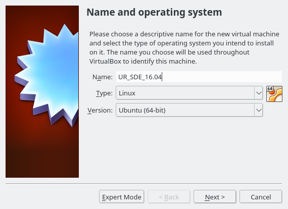

   Please enter "UR_SDE_16.04" as the `Name`, select "Linux" as the `Type`,
   make sure the `Version` is set to "Ubuntu (64-bit)".

   When that is done, click on the `[Next>]` button.

3. Memory size window

   When you get the "Memory size" window, it should look as follows:

   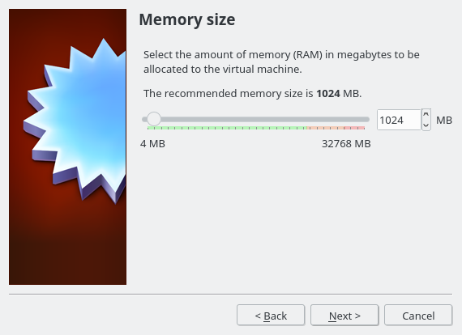

   Make sure that it says 1024MB and then click on the `[Next>]` button.

4. Hard disk window

   When you get the "Hard disk" window, it should look as follows:

   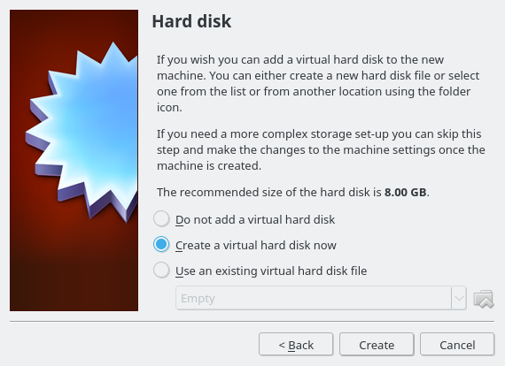

   Make sure that "Create a virtual hard disk now" is selected and click on the
   `[Next>]` button.

6. Hard disk file type window

   When you get the "Hard disk file type" window, it should look as follows:

   

   Please make sure that `VDI (VirtualBox Disk Image)` is selected and click on the
   `[Next>]` button.

7. Storage on physical hard disk window

   When you get the "Storage on physical disk" window, it should look as follows:

   

   Please make sure that `Dynamically allocated` is selected and click on the
   `[Next>]` button.

8. File location and size window

   When you get the "File location and size" window, it should look as follows:

   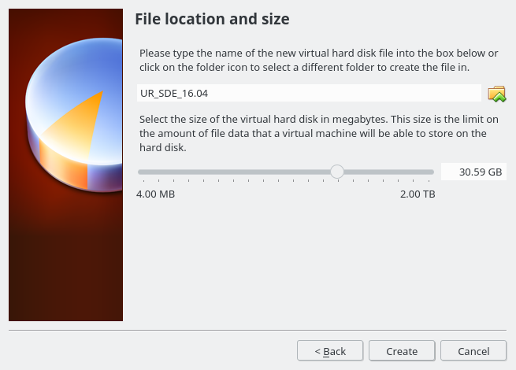

   Please leave the location set to "UR_SDE_16.04" and adjust the file size to
   be greater than 30GB.  Please note that the slide bar is non-linear as you
   move left and write.  Please slide it until you get a file size of around 30GB.
   Afterwards, please click on the `[Create]` button.  This will cause the virtual machine
   to be created.

9. Virtual machine created

   After the virtual machine is created, the VirtualBox window should look as follows:

   

You have successfully created a new virtual machine.  The next task is to load
a version of ubuntu 16.04 into the virtual machine.

## Install Ubuntu 16.04 into Virtual Machine

Please perform the following steps to install Ubuntu 16.04 into your newly created
virtual machine.

1. Download Lubuntu 16.04

   `lubuntu` is a version of ubuntu that includes LXDE.  What is LXDE?
   LXDE the abbreviation for "Lightweight X11 Desktop Environment".
   What is really going on here is that ubuntu supports multiple different
   desktop graphical user interfaces.  LXDE is one of the smaller desktop
   graphical user interfaces.  The UR team selected LXDE because it is small.
   The bottom line is you need download the correct lubuntu file an follow
   the remaining steps to get it installed into your virtual machine.

   Using your web browser, please download the file 
   [`lubuntu-16.04-desktop-amd64.iso`](http://cdimage.ubuntu.com/lubuntu/releases/16.04/release/lubuntu-16.04-desktop-amd64.iso)
   and put it somewhere in your file system where you can find it.
   It is needed for the next step.

2. Start the virtual machine

   To start the virtual machine, bring up virtual box just double click
   on the icon that says `UR_SDE_16.04`:

   

   In short order, you should see window that looks as follows:

   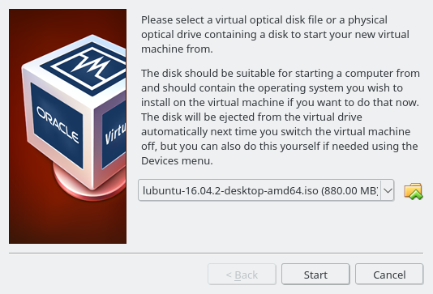

   The key thing here is to use the file chooser to specify the file that
   you just downloaded (i.e. `lubuntu-16.04-desktop-amd64.iso`)
   in the previous step into the window.

   Once you have selected the file please click on `[Start]`.

3. Let lubuntu 16.04 Boot

   After click on `[Start]`, the virtual machine will quickly start to boot `lubuntu`.

   Relatively quickly, you will see the screen below:

   

   This screen has a 30 second time-out on it.  Just let it time-out
   without touching your keyboard or mouse.

   After the time out the next major screen you will see looks as follows:

   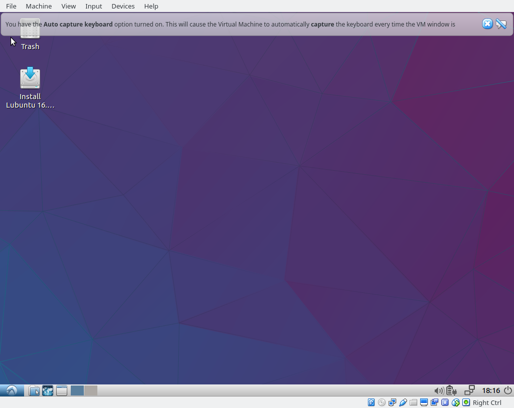

   At this point in time, your virtual machine is running lubuntu 16.04.  However,
   lubuntu has not yet been installed.  The actual installation steps come next.

4. Start lubuntu Installation

   On the virtual machine display, there are two icons at the upper left corner.
   One is labeled `Trash` and the other is labeled `Install`.  Please double click
   on the `Install` icon.  When you do this you will get the following screen:

   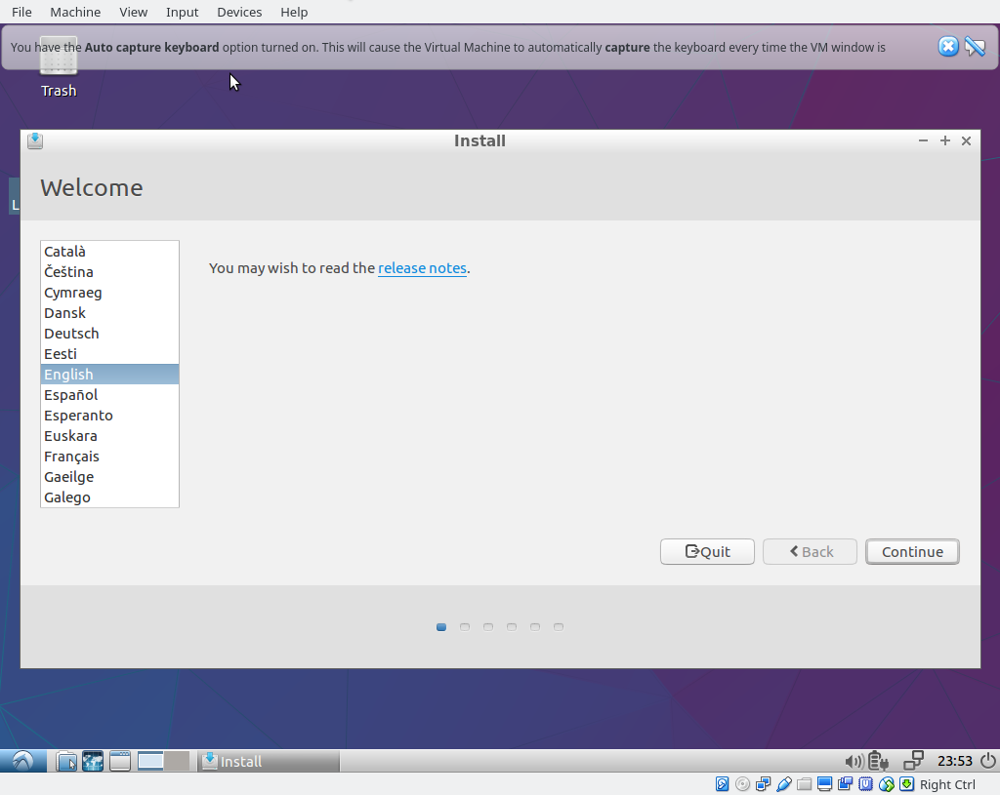

   Please click on the `[Continue]` button to start the install process.

5. Prepare to Install lubuntu

   The next screen is the prepare screen and it looks as follows:

   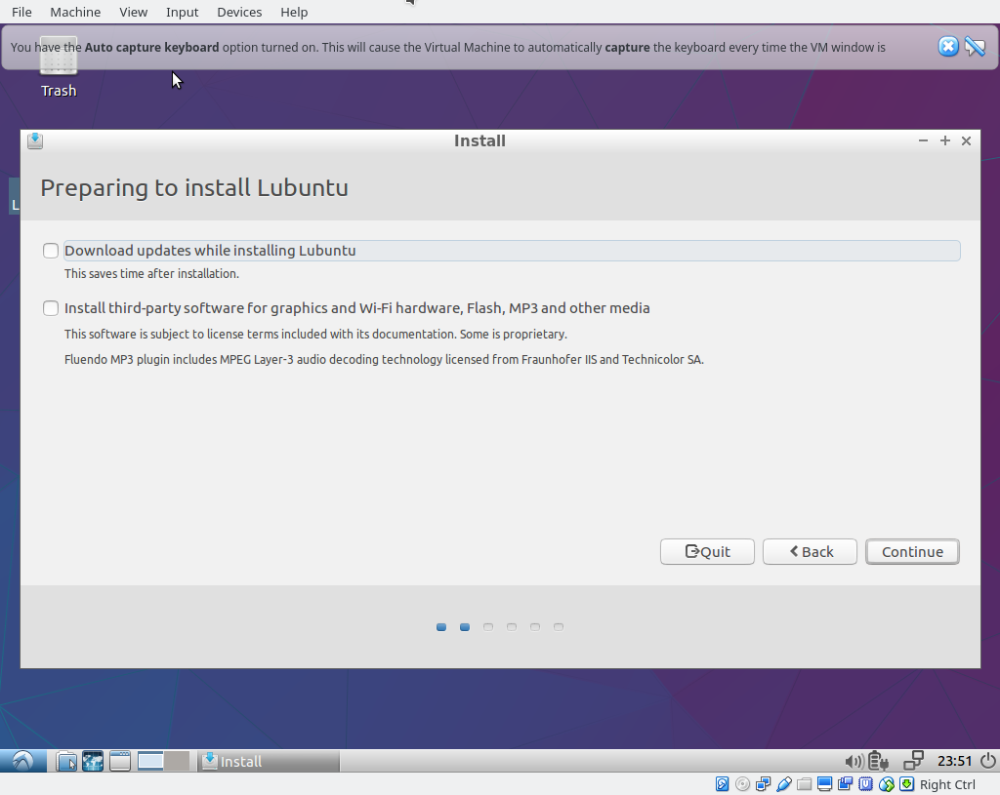

   Please do *NOT* check off either `Download updates while installing Lubuntu` or
   `Install third-party software for graphics and WiFi hardware, Flash, MP3 and other media`.
   Leave both of these check boxes unchecked.

   Now you can click on the `[Continue]` button.

6. Prepare virtual disk drive for lubuntu.

   The next screen you will see looks as follows:

   

   Be sure select `Erase disk and install Lubuntu`.  Yes, the warning is scary
   sounding, but in fact the only disk that will be effected is the virtual
   disk associated with your virtual machine.

   Please click on the `[Install Now]` button.

   You will immediately get the next screen:

   

   Please click on the `[Continue]`.

7. Set Time Zone

   You should get a time zone selection screen that looks as follows:

   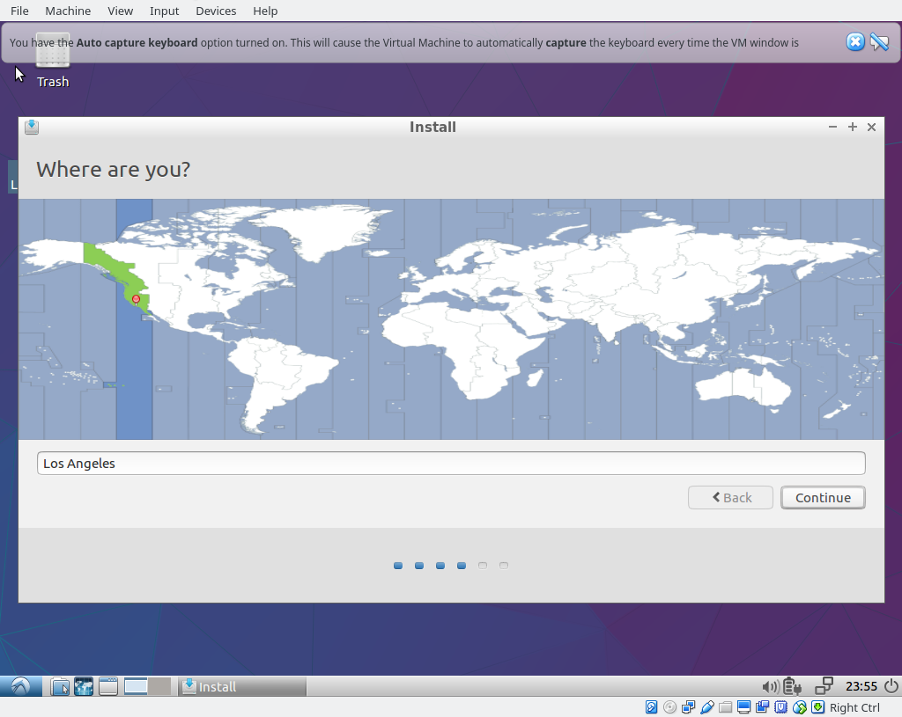

   Please select the time zone that make the most sense for your
   geographic location.

   Please click on the `[Continue]` button.


8. Set Keyboard

   Next, you should get a keyboard selection screen that looks as follows:

   

   Please select the keyboard that matches the keyboard you actually have.
   If in doubt, please leave it set to `English`.

   Next, please click on the `[Continue]` button.

9. Initial Account

   Next you should get an initial account screen that looks as follows:

   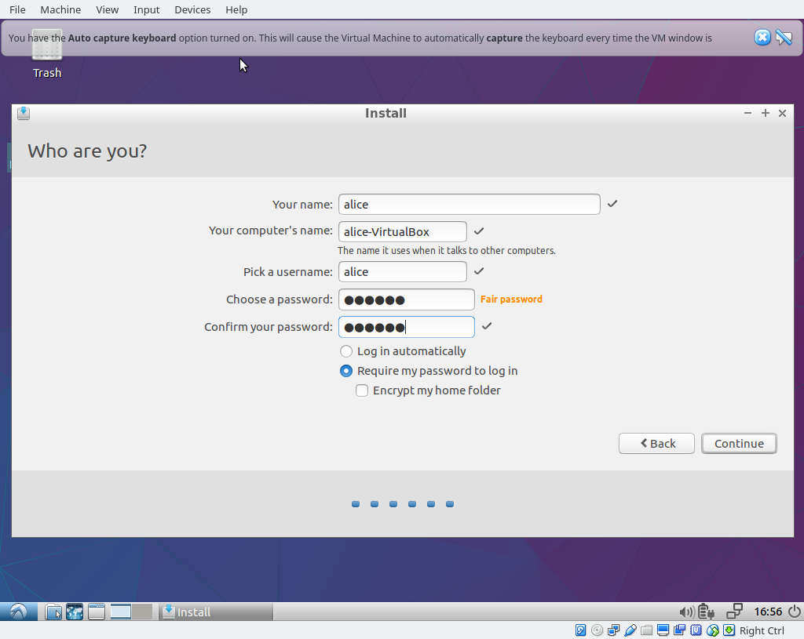

   Please type in an account name of your choosing (the example shows `alice`)
   into the `Your Name:` field.
   In addition, please type a password into both the `Choose a password:` field.
   Please type the same exact password into the `Confirm your password:` field.
   Do *NOT* check out `Log in automatically`.  Instead leave
   `Require my password to log in` checked off.  Leave the `Encrypt my home folder`
   unchecked as well.

   Please remember your account name and password, you will need them later on.

   Please click on the `[Continue]` button.

10. Installation Window

    As lubuntu is installed you will see a screen that looks similar to
    what is shown below.

    

    It will take a while to install everything, so just lean back and enjoy
    the slide show.

11. Restart Window

    After everything is installed you will get a restart window that looks as follows:

    

    Please click on the `[Restart Now]` button.

    Very quickly your virtual machine should shrink its display to be small and
    and look as follows:

    

    If this screen, does not disappear in 5 to 10 seconds, it will be necessary
    to do a some simple extra steps to finish shutting down the virtual machine.

    Please go to your virtual box window and find the `UR_SDI_16.04` icon.
    With your mouse over the the icon, please right click your mouse button
    to get the following  pull down menu:

    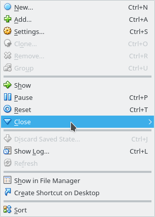

    Select the `Close>` menu and you should see a further pull right menu
    that looks as follows:

    

    Please select the `Power Off` menu.  Next, you will get a window that looks as follows:

    

    Please click on the `[Power Off]` button to finish powering the virtual machine.

Your VirtualBox window should now look as follows:


Congratulations, you have just successfully installed lubuntu 16.04 into your
`UR_SDE_16.04` virtual machine for VirtualBox.

## Install VirtualBox Guest Additions

The next set of steps is required to install the VirtualBox guest extensions.
With these extensions, you will be able to do such things are resize the
virtual window size, etc.

1. Log In to Lubuntu 16.04

   Restart the virtual machine by double clicking on the `UR_SDE_16.04` icon
   VirtualBox window.  After a small delay you should get the following
   login window:

   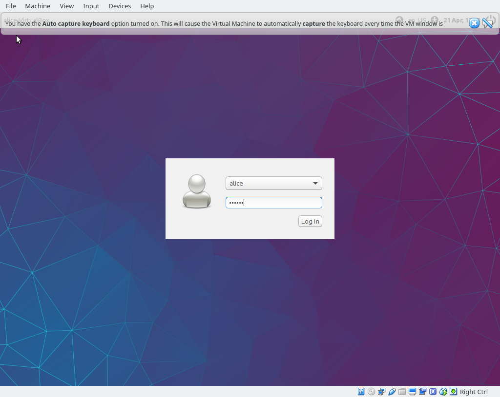

   Please type in the account name and password that previously supplied
   when you installed Lubuntu 16.04.  Now you can click on the `[Login In]`
   button to login.

   After you log in, you will get the following rather plain window:

   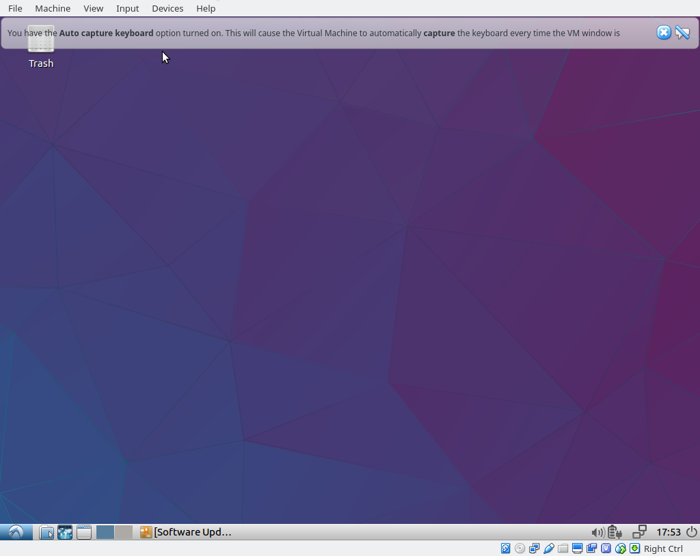

2. Insert Guest Additions CD

   The next step is to get the Guest Additions CD installed into your virtual
   CD drive on your virtual machine.  This is done by going to the `Devices`
   pull down menu and selecting `Insert Guest Additions CD Image...` from
   the menu shown below:

   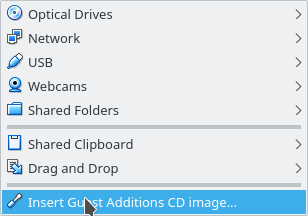

   After you do that, you will get a display that looks as follows:
   
   

   Since the file manager is not needed, please click on the `[Cancel]` button
   to make it go away.

5. Bring Up A Terminal Window

   The next task requires that you type a command inside a terminal window.
   Just so you know, Linux in general and ROS in particular tends to be
   a little heavy on terminal window use.

   In order to bring up a terminal window, you first depress and hold down
   both the `[Ctrl]` and `[Alt]` keys and then depress the letter `[T]` key.
   This keyboard judo is abbreviated as Ctrl-Atl-T.  After you done these
   keyboard gymnastics you will git the following screen:

   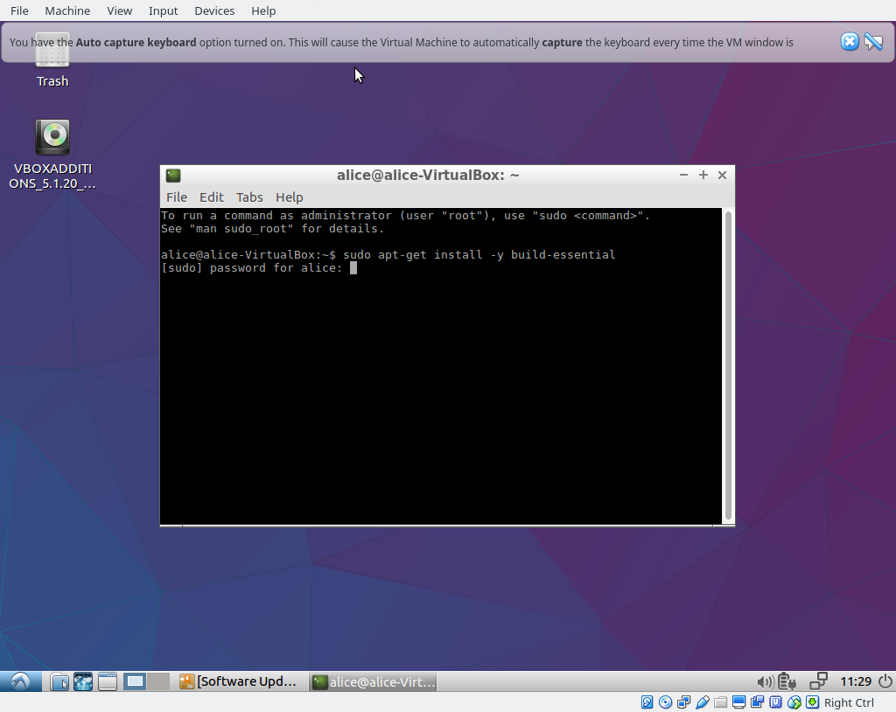

   Once the terminal window comes up, move the mouse pointer inside the
   terminal window and click the left mouse button to make sure that
   keyboard keystrokes will be directed into the terminal window.

   Now type the following command:

   ```sudo apt-get install -y build-essential```

   What this command does is install the standard Linux compiler programs
   (collectively called `gcc`) and another program we are going to need called

   After you type the command above, you will prompted for a password.
   Please type in the password you used to login with.

   

   This command will grind away for a little while and then stop.

7. Install Guest Edition Software

   Next you will install the guest edition software.  This is done with the
   following command:

   ```sudo /media/*/*/VBoxLinuxExtensions.run```

   It will cause the VirtualBox guest additions to be installed.  You may be asked
   to type in a password again.

   

   Again, the compute will grind away for a little while and the it will stop.
   At this point, the guest extensions are installed.

8. Log Out and Shut Down

   Now we can logout and shutdown the virtual machine.  Do do this, you need to
   move your mouse curse to the lower right corner and   click on the power button
   icon.  This will pop a window that looks as follows:

   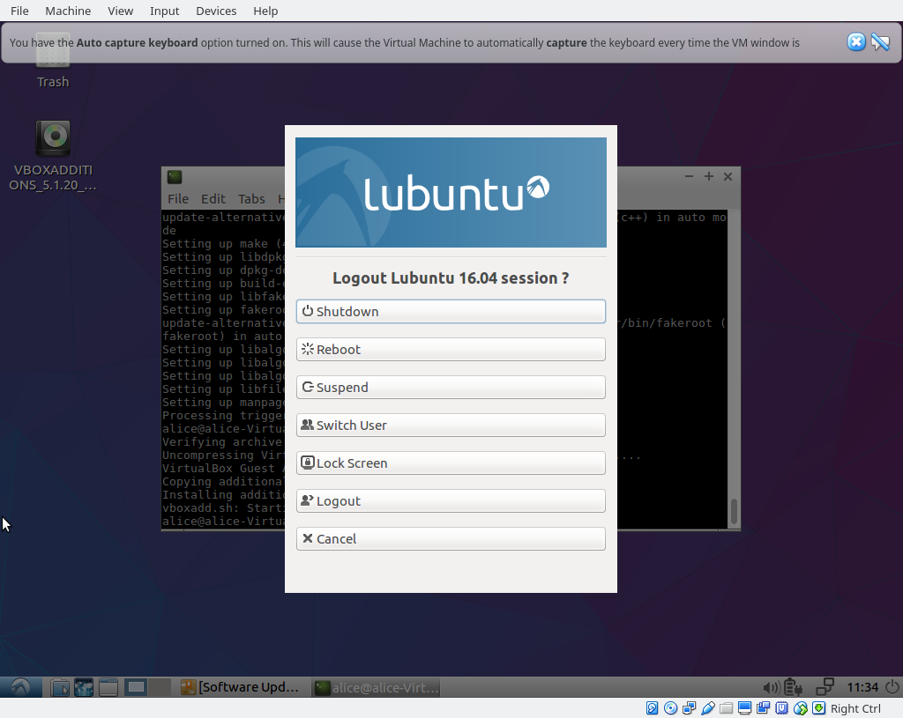

   Please select the `[Shutdown]` button to force a log out and virtual machine
   shut down.

That concludes the guest additions installation.

## Conclusion

That is all that is required to install VirtualBox, Lubuntu 16.04, and the
VirtualBox guest extensions.

The next step is to install ROS Kinetic and the rest of the UR SDE.

------------------------------------
## Old stuff

{Ignore this stuff for now}


* Download Lubuntu 14.04 LTS.  Lubuntu is a lightweight version of Ubuntu. You will get a file with
  a suffix of .iso. (A .iso file is an image of a CD/DVD ROM.)
  You will feed this file to VirtualBox to set up your virtual machine.	

    http://cdimages.ubuntu.com/lubuntu/releases/trusty/release/	        # choose the 64-bit PC (AMD64) desktop image


* Start up VirtualBox and click on **New** to create a new virtual machine.
  Give your new virtual machine a Name (how about "yourname-ros"), Type (Linux), and Version (Ubuntu (64-bit). It is reasonble to default pretty much everything
  else, except the virtual hard disk size, which should be at least 32 GB.  **Do not start your virtual machine yet.**
  
  Your new VM should appear in the list of virtual machines, and should be selected.

* Click on the **Settings** button to bring up the virtual machine settings panel.

  * In the Settings panel, click on **System** and make sure
    that the boot order is set to try CD-ROM ("Optical") first and disk second.
    Not that it matters, but the floppy disk should be disabled.

  * In the Settings panel, click on **Display**.  Given
    how intense `rviz` is with graphics, upping the video memory
    to 64MB seems prudent.  Enable 3D acceleration as well.

  * In the Settings panel, click on **Storage**.  You need
    to find or make an optical drive.  It is indicated by a small icon intended to look like a CD-ROM. 
	If there is one, it should show "empty".  Now click the word "empty", and attach
    the Lubuntu .iso file to the drive. There is a small icon picturing an optical disk next to the optical drive name for doing this.  
	If there is no optical drive, add one to the IDE Controller.  Again, there is an icon for this.

  * In the Settings panel, click on **Network**.  Enabme the Network adapter, and select
    the Bridged Adapter.

 * Now you can start your virtual machine by clicking on the
  **Start** button. It will boot from the .iso file that you have loaded into the (virtual) optical drive. 
  
  Choose the "Install Ubuntu" option. 
  Do not choose the option to download updates while installing. The remaining installation steps are self-explanatory. 
  The virtual machine should close and restart automatically, but if it does not, close it (File/Close) and restart it. 

* Upon restart, log in with your password.   The screen will show up in 640 x 480 mode no matter how you resize the larger
  window.  Later steps fix this problem.

* Find a terminal window.  In Ubuntu, there is a Search icon at the top of the launcher (the column of icons on the left of the screen).  Search for "terminal"; this will find the terminal application.  In Kubuntu, it is found in the lower
  left corner **K with Gear** => **Applications** => **System** => **Terminal**.
  It is possible to drag the terminal icon from the launcher to the
  desktop. Start the terminal.  If you need help, try reading:

    http://askubuntu.com/questions/38162/what-is-a-terminal-and-how-do-i-open-and-use-it

* From the terminal, update the software:

        sudo apt-get update	     # Takes about a minute
        sudo apt-get upgrade     # Takes 1 to 10 minutes

* Now that you have a terminal, it is time to install the "VirtualBox
  Additions" to solve the small screen issues.  This URL is useful:

    http://www.binarytides.com/vbox-guest-additions-ubuntu-14-04/

  * Download some useful stuff:

        sudo apt-get install build-essential module-assistant dkms
        sudo m-a prepare

  * Now find the **Devices** submenu on your virtual box window.
    Select **Devices** => **VirtualBoxGuestAddtions.iso disk**.
    Sometimes Ubuntu will offer to run the disk image; let it do so. 

  * Otherwise, Ubuntu will normally have mounted the contents of the .iso on
    `/media/USERNAME` where `USERNAME`is your user name.  If it
    does not show up (i.e. try `ls /media/USERNAME`), try the following:
		sudo mkdir -p /cdrom
		sudo mount /dev/cdrom /cdrom
		ls /mnt

	Fire off the `VBoxLinuxAdditions.run` script, which may take a few minutes:
        cd /path..to/VBOXADDITIONS*          
		sudo ./VBoxLinuxAdditions.run     
-------------------------------------------- the following does not work, no response from vboxguest
 * Do the following and check that the VERSION and LINUXVERSION
    match what you have installed:

        # check loaded modules
        $ lsmod | grep -io vboxguest
        vboxguest
        # check module 
        $ modinfo vboxguest
        filename:       /lib/modules/LINUXVERSION-generic/updates/dkms/vboxguest.ko
        version:        VERSION
        license:        GPL
        description:    Oracle VM VirtualBox Guest Additions for Linux Module
        author:         Oracle Corporation
        .....
        $ lsmod | grep -io vboxguest | xargs modinfo | grep -iw version
        version:        VERSION
		
		___________________________________________________________________________down to here

  * Reboot your virtual machine:

        sudo reboot

  * Log in again and bring up a terminal window.  For convenience, lock the terminal application to the Launcher.  TODO: HOW?
  At this point the VM console will be able to expand to fill the window provided for it by VirtualBox. 
  In the **Devices** menu you will also be able to activate the shared clipboard, drag & drop, and shared folders (with the host).
  
  * Install avahi-daemon, which allows connection by machine name instead of IP address.
  
		sudo apt-get install libnss-mdns
		
At this point a virtual machine has been created and Lubuntu has been installed.  It is ready for the installation of ROS and the Ubiquity software.
  
  * Now follow the instructions for installing ROS indigo:

        http://wiki.ros.org/indigo/Installation/Ubuntu
		
		TODO:  we don't know how to add whatever to the repositories, as in the U. instructions
			
  * Some notes on the installation instructions:

	  * If you are not using Ubuntu, think about using `synaptic` to configure the repositories:

			sudo apt-get install synaptic
			sudo synaptic
			
		Use **Settings** => **Repositories** and select the appropriate repositories.  Click **OK**, then **Reload**.  Kill synpatic.

		Right before you install the full desktop install:

			sudo apt-get update
			
	Now install the desktop
		
        sudo apt-get install ros-indigo-desktop-full
		
  * Environment Variables
  
    Two environment variables, ROS_MASTER_URI and ROS_HOSTNAME will
    have to be set.  ROS_HOSTNAME must have the name of this virtual
    machine, and ROS_MASTER_URI must be the IP address (or equivalent)
    of the robot, and must be the same on both your VM and on the robot.
    Of course, you cannot set this until your robot is up. But you can
    set ROS_HOSTNAME now.

        env | grep ROS_HOSTNAME     # Show settings of env. var.
	export ROS_HOSTNAME="yourname-ros"  # if that's what you named it.

 * It makes sense to install some editors:

        sudo apt-get intall vim emacs

That kind of wraps it all up.
